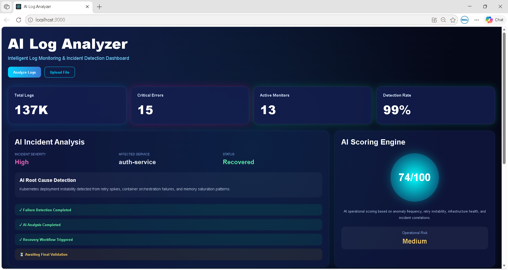
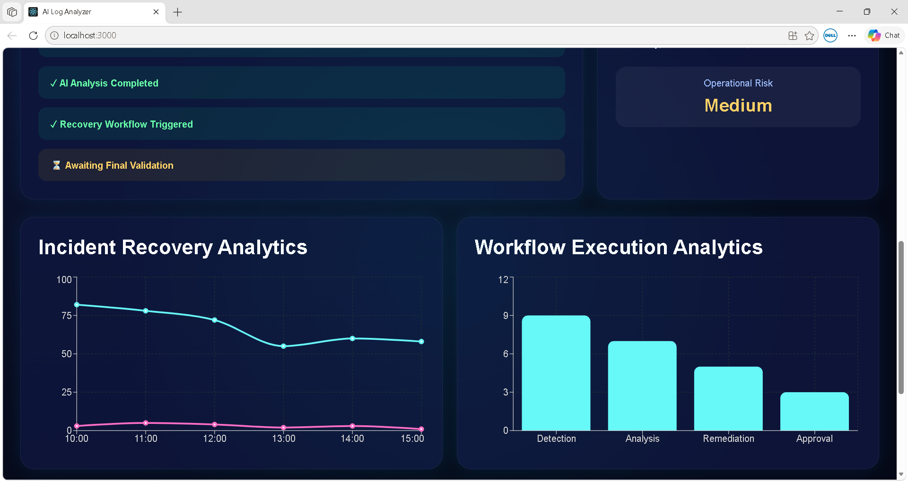

# AI Log Analyzer

AI-powered log monitoring and incident detection dashboard built using React.js and Recharts.

## Features

- AI Incident Analysis Dashboard
- Real-time Workflow Analytics
- Incident Recovery Analytics
- AI Root Cause Detection
- Upload Log File Section
- Operational Risk Scoring
- Responsive Dark UI

## Tech Stack

- React.js
- Recharts
- CSS3
- JavaScript

## Screenshots

### Dashboard Overview


### Analytics Dashboard


### Upload Log Section


## Installation

```bash
npm install
npm start